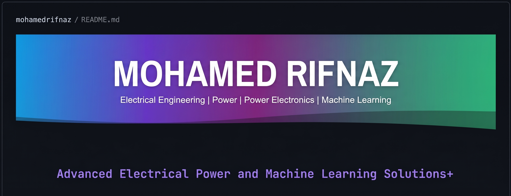

  
  
    

  
  
  
 

---

### 👨‍💻 About Me

Third-year Electrical Engineering student at the University of Moratuwa with strong interests in power electronics, electrical machines, renewable energy, control systems, and automation. A Mathematics enthusiast with a strong academic interest and analytical problem-solving abilities, seeking to apply engineering knowledge and develop practical skills through industry experience. Interested in contributing to real-world engineering projects in power, energy, and automation.

   
  
  
  
  
  
   
  
    

> 🎯 **Current Focus**
> Electrical Engineering + Power Electronics + Automation & Control + Embedded Intelligence

---

### 🧰 Technical Stack

  <h4>⚡ Electrical • Control • Simulation</h4>
  
  
  
  
  
  

  <h4>💻 Programming • Software Development</h4>
  
  
  
  

  <h4>🔌 Hardware • Microcontrollers</h4>
  
  
  
  

---

### 🚀 Featured Projects

* **Smart Haptic Wristband for Musicians:** Developed a wireless haptic metronome system that delivers beat information through vibration instead of an audio click track. Integrated sensors and actuators with an ESP32-based wristband for real-time beat detection and haptic feedback. Implemented wireless communication and synchronization between the control unit and wristband for consistent timing during musical performance. 
* **Advanced Light Intensity Indicator (ALII):** Designed a DSP-based system to measure and display light intensity with real-time stability controls. Implemented configurable averaging windows (30-900s) to reduce sudden variations and provide stable light intensity readings. Developed the system for potential integration with solar-based applications and energy-efficient monitoring.
* **Automated Occupancy Detecting AC Control System:** Developed an occupancy-based AC control system to improve energy efficiency by automatically adjusting AC operation based on room occupancy. Designed and validated the control logic in MATLAB/Simulink using discrete-time timers for Eco mode and automatic shutdown. Designed a ventilated enclosure and sensor housing in SolidWorks, integrating provisions for the display and electronic components.
* **FixItNow Web Application:** Served as the Database Team Leader to develop a web-based application designed to connect users with service providers for various repair and maintenance services[cite: 2]. Implemented database management and application functionality using Java and MySQL. Designed features to support efficient service requests and communication between customers and service providers.
